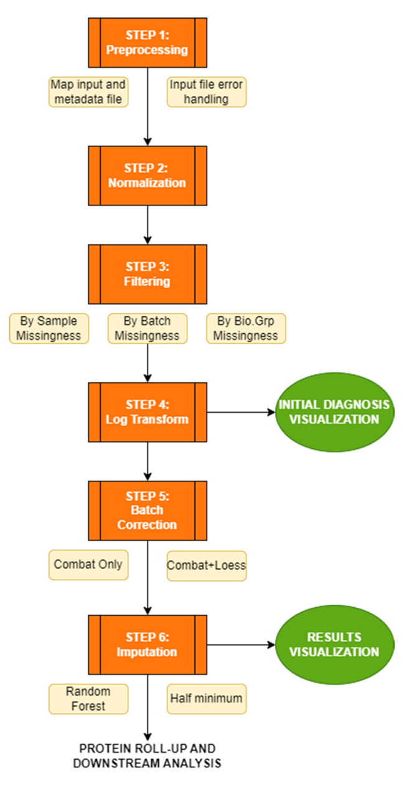
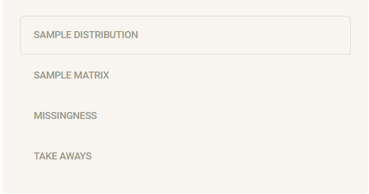
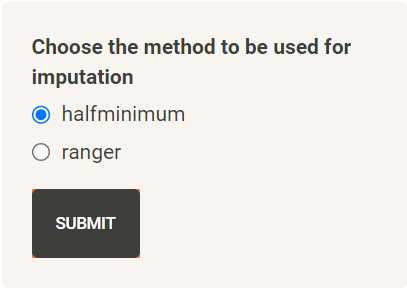
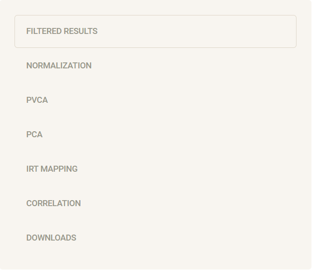

# BIRCH Usage and Instructions

## Table of Contents
- [What is BIRCH](#what-is-birch)
- [Requirements](#requirements)
- [Example usage](#example-usage)
- [Using BIRCH](#using-birch)
- [Cite us](#cite-us)
- [Support](#support)
- [Release notes](#release-notes)
- [License](#license)

## What is BIRCH
[BIRCH](https://batch-correction-tool.herokuapp.com/) (**B**atch-effect **I**dentification, **R**ectification, and **C**onclusive-anlaysis on **H**eterogenous data) is a web-app that can be used for reducing batch-effect in proteomics data. It generally becomes necessary to correct for batch-effect in large datasets since processing steps such as sample preparation and data acquisition tends to add noise to the data, that in-turn effects biological conclusions. This tool aims at keeping meaningful biological variation, while simultaneously reducing batch-effect due to other external factors. 

## Requirements
- Web Browser (Google Chrome, Mozilla Firefox, Microsoft Edge, Safari) with stable internet connection. 
- Input files with protein intensitites and an annotation file (explained in detail in the next section). 

## Example usage
Please refer to our example [example](example/) for a more detailed and hands-on walkthrough on how to use BIRCH.

## Using BIRCH
The general workflow is as follows:

Below we list each tab with a description of it includes. For details on the results generated and to understand how to use the plots/analysis, please refer to the example usage above. 

### Settings tab
When the BIRCH web-app initially loads, the settings tab is displayed at first.

This tab is dynamic, and you will be asked to upload files and choose input parameters. The left side panel allows you to make your choices, while the right side main panel will display a pre-view of the files you uploaded.  

In this tab, you will have to upload 3 files:
1. Normalized data 
2. Unnormalized data 
3. Annotation file

Additionally, you will be provided with dropdown menus generated using the uploaded data to select the mandatory parameters that are as follows:
1. From normalized and unnormalized files - Option to choose the column representing the protein names.
2. From annotation file - Choose the columns to correct for batch-effect (you can choose multiple options based on your experiment design).
3. From annotation file - Choose the column containing the experimental/biological group (this is the group in which we want to retain variation coming from meaningful biological differences).
4. From annotation file - Select the column with sample names that match the headers in the normalized and unnormalized file. 

Here are some specifications to make sure the input files abide by the requirements:
1. The normalized and unnormalized files should have the same rows and columns, only the intensities should vary depending on the normalization procedure used. 
2. The protein names should be provided as the first column in the normalized and unnormalized files, followed by columns corresponding to one sample each with the intensities. 
3. Columns with sample names in the normalized and unnormalized files should match with the sample names in the annotation files. Number of samples in annotation file and intensity data files should be the same. 
4. Annotation file should have columns corresponding to the different batches you want to analyze (eg. MS batch, Digestion batch, Differentiation batch, etc.), along with the biological experimental group. 

Once the data is uploaded, a preview of the uploaded data will be visible in the main panel and the next Initial analysis and Diagnosis tabs becomes active. 

### Initial analysis tab
This is a static tab that displays some plots with initial analysis that are generated using the data uploaded in the settings page. This tab in-turn has 3 sub-parts that are characterized as Sample distribution, Missingness and Take-away.  

The sample distribution section displays a plot with the number of samples in each batch (as chosen in the settings tab). The missingness section displays multiple plots that shows how much of the input data is missing/NA, this will also give you an idea of how much data will be imputed in the next step. Lastly, the take-away section gives breif statistics on sample distribution and missingness, which inturn helps with taking a decision on whether the data is suitable for batch correction. 

### Diagnosis tab
The Diagnosis tab is the next dynalic tab where user input is required. In this tab, you will first need to provide 3 parameters:
1. Imputation method - BIRCH provides two options for imputing missing values. Imputation is required for generating a PVCA and other results that are necessary to draw conclusions on batch-correction. The half-minimum method is faster but not very efficient in terms of results, while ranger takes longer and uses random-forests to impute missing values. 
2. Prefix for output files -  The final results tab has a section to download results from. Using this option, you can provide a prefix for your downloadable files based on your project specifications. 
3. iRT protein name - This is an optional field where you can provide the name of your iRT protein. This is make additional plots regarding the iRT protein in the results tab. 

On hitting the submit button after these options are provided, missing data is imputed and a PVCA is generated in the main panel. Using the PVCA, the algorithm makes a decision on which batch to correct on (based on the columns to correct for batch-effect, as provided in the settings tab), and a note with the column to correct on will be displayed below the PVCA. Additionally, the left panel is populated with additional parameters once the PVCA is generated. 

If your biological group has the most variation to begin with, a note saying batch-correction is not required for your data will be generated. If you still want to batch-correct, select the variable to correct on in the left panel.

Lastly, in addition to the column to correct on, you can choose "experimental group:batch" combination to study correlation in replicates. At this stage you also get 3 options for filtering (scroll bar set to defaults) which include:
1. Sample threshold - To identify samples with a lot of missingness. Samples that have missingness above the given threshold will be dropped. 
2. Experimental group threshold - This filter is applied to make sure each experimental/biological group has a certain percentage of intensities that are present. We usually keep a cut-off of 50% for this filter and if any feature/fragment/protein has all experimental groups with over 50% missingness, it will be dropped.
3. Batch threshold - This is applied to make sure each batch (within variable/column to correct on) has a certain percentage of intensities that are present (non-missing). Features/fragments/proteins having missingness more than the specified threshold will be dropped. 

As a note: If all thresholds are set to 1.0 (i.e., you don't want to filter anything), we will carry out minimal filtering by default (at least 2 non-missing intensities per batch). 

On hitting continue, a few plots will be displayed in the main tab that show how the filtering criteria chosen by you will affect the data and what will be filtered out. Simultaneously, the results tab becomes active. 

### Results tab
The results tab is the final tab that is static and is loaded with all the final results, including plots created using filtered data, results comparing nomalized and unnormalized files, and other batch-correction related results. The sub-sections within the results tab are as shown in the below image. 

The final batch-corrected data (pre and post-imputation) can be downloaded in the "Downloads" sub-section in the results tab. Additionally, an HTML report that contains all the results/plots from the web-app can also be downloaded for convinience. 

## Cite us

## Support
If you encounter any bugs or issues, please help us improve PINE by creating a new issue at: XXX
For any other queries, email us at GroupHeartBioinformaticsSupport@cshs.org.

## Release notes
### Version 2.0.1
- Initial version released.
- Three input files required.
- Displays whether combat only or combat+loess should be used for downstream analysis. 

## License
See the [LICENSE](https://github.com/csmc-vaneykjlab/pine/blob/master/LICENSE) file for license rights and limitations (Apache 2.0).